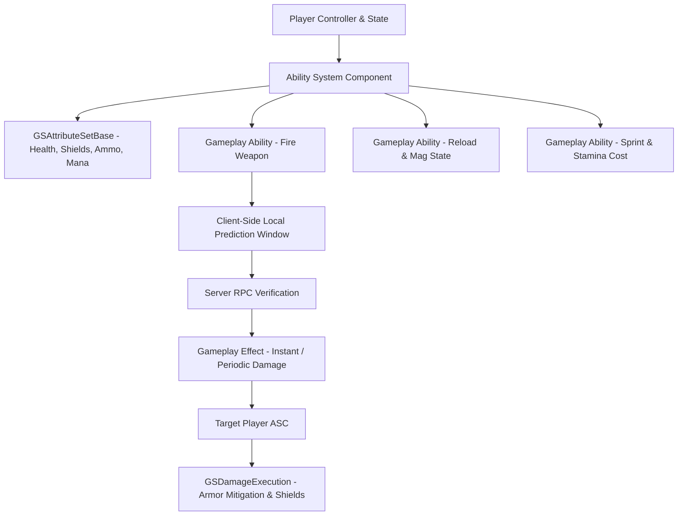

# GASShooter Tactics — WebSpider Studios


-brightgreen)


**GASShooter Tactics** is an advanced multiplayer FPS/TPS combat framework developed and extended by **WebSpider Studios (Vivekanand Rajbhar)**, built on Unreal Engine's **Gameplay Ability System (GAS)**.

This project serves as an industry-standard technical showcase for client-predicted weapon firing, server-authoritative damage calculation, ability cooldowns, and full network replication.

---

## 🎯 Systems Architecture



### 1. Gameplay Ability System (GAS) Core
* **Client-Predicted Weapons**: Semi-auto, burst, and full-auto weapons with instant client prediction and server reconciliation.
* **Attribute Sets (`GSAttributeSetBase`)**:
  * Health & Max Health
  * Shield & Max Shield (with auto-recharge delay logic)
  * Stamina & Stamina Regen
  * Ammo per weapon magazine and reserve pools
* **Custom Execution Calculations (`GSDamageExecution`)**: Armor-mitigated damage models separating shield impact from direct health attrition.
* **Gameplay Cues**: Networked audio/visual effects for impacts, weapon discharges, and shield breaks with zero gameplay logic coupling.

### 2. Networking & Replicated Weapon Handling
* **Inventory & Weapon Slots**: Multi-slot replicated weapon inventory supporting instant hotkey swaps.
* **Hitscan & Projectile Physics**: Line trace weapon verification with lag compensation and physical bullet drop.
* **Prediction Keys**: Flawless sync between client activation and server confirmation preventing jitter.

### 3. User Interface (UMG)
* **Real-time GAS Data Binding**: UI widgets automatically subscribe to Attribute Change delegates (Health, Shields, Ammo).
* **Crosshair Spread & Dynamic Recoil**: Visual feedback reflecting player movement state and continuous burst bloom.

---

## 🛠️ How to Build and Run in Unreal Engine

### Prerequisites
* **Unreal Engine**: 5.8 or 5.7 installed via Epic Games Launcher
* **IDE**: Visual Studio 2022 (with *Game Development with C++* workload)
* **OS**: Windows 10/11 (64-bit)

### Steps
1. Clone this repository:
   ```bash
   git clone https://github.com/VR-WebSpider/GASShooterTactics.git
   ```
2. Right-click `GASShooter.uproject` and select **Generate Visual Studio project files**.
3. Open `GASShooter.sln` in Visual Studio 2022.
4. Set the build configuration to **Development Editor** and platform to **Win64**.
5. Launch the editor (F5 or double-click `GASShooter.uproject`).
6. Load the test combat level in `/Game/GASShooter/Maps/` to test multiplayer PIE (Play In Editor with 2+ players).

---

## 🏢 Credits & Attribution

* Developed and extended by **WebSpider Studios (Vivekanand Rajbhar)**.
* Built upon the foundational Gameplay Ability System architecture created by **Dan Kestranek (tranek)**. Licensed under the [MIT License](LICENSE).